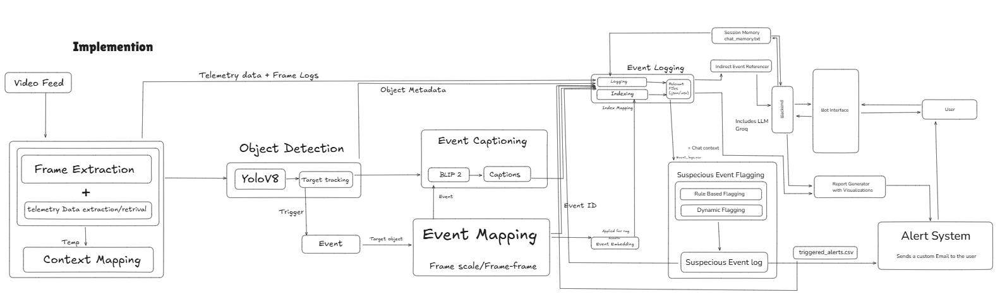
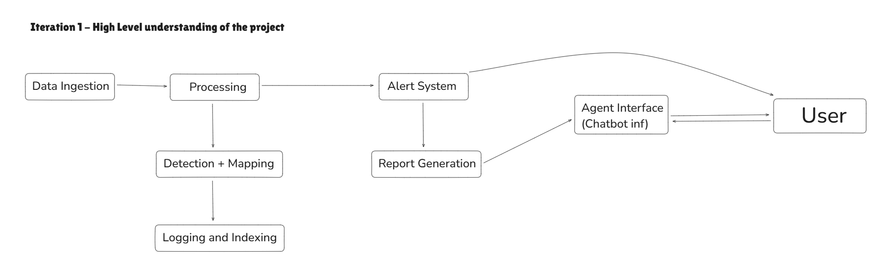
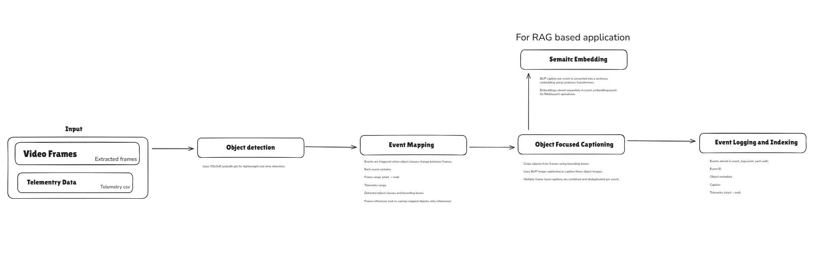
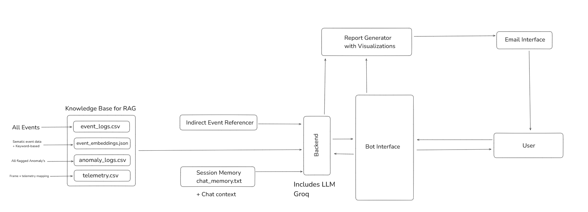
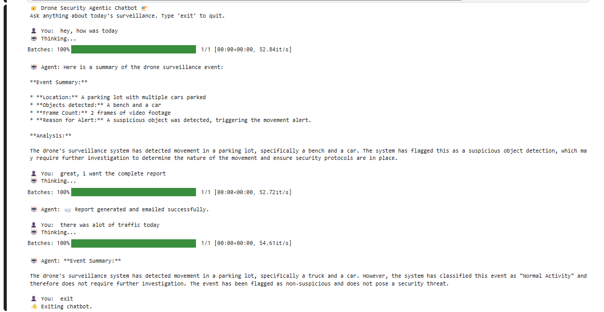
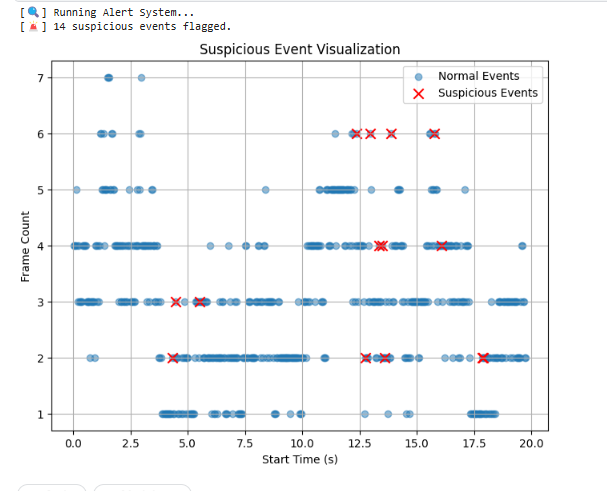
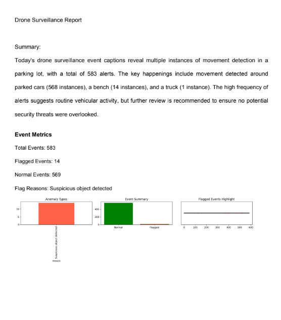
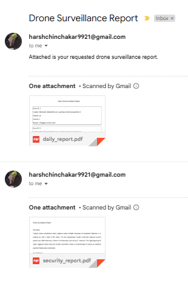
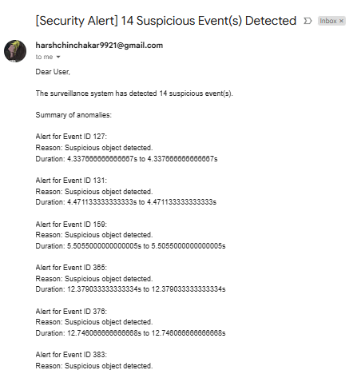
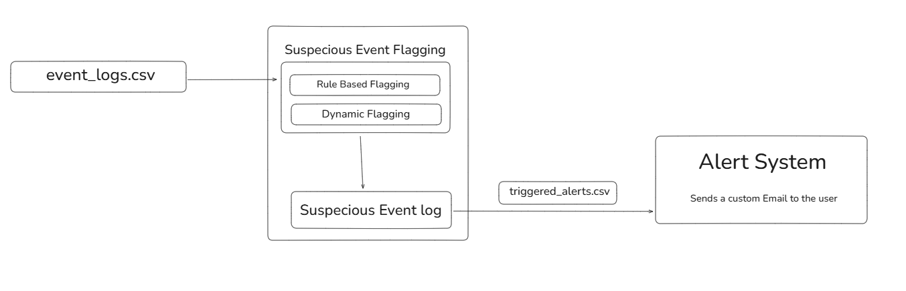

# Drone Security Analyst Agentic Chatbot 🛡️

## 📌 Overview

The **Drone Security Analyst Agentic Chatbot** is a real-time surveillance intelligence system that processes drone footage and telemetry data to deliver semantically enriched, context-aware analytics, alerting, and automated reporting. It is designed for deployment in resource-constrained environments like **Kaggle Cloud Notebooks**, while still demonstrating production-grade modularity and extensibility.

> 🕒 This project was completed within **8 hours**, inclusive of code development, documentation, and testing, using AI tools to enhance velocity and precision. Due some emergencies on my end, i was unable to dedicate the time promised. I apologise and take responsiblity for the same. 

---

## 📂 Table of Contents

- [Project Motivation](#project-motivation)
- [High-Level Architecture](#high-level-architecture)
- [System Modules](#system-modules)
  - [Module 1: Object Detection & Captioning](#module-1-object-detection--captioning)
  - [Module 2: Semantic Embedding & Search](#module-2-semantic-embedding--search)
  - [Module 3: Agentic Chatbot Kernel](#module-3-agentic-chatbot-kernel)
  - [Module 4: LLM Integration with GROQ](#module-4-llm-integration-with-groq)
  - [Module 5: Context & Memory Management](#module-5-context--memory-management)
  - [Module 6: Visualization & Reporting](#module-6-visualization--reporting)
  - [Module 7: Email Delivery System](#module-7-email-delivery-system)
  - [Module 8: Alert Trigger Logic](#module-8-alert-trigger-logic)
- [Novel Approaches](#novel-approaches)
- [Testing Strategy](#testing-strategy)
- [Deployment Notes](#deployment-notes)
- [Timeline](#timeline)
- [Artifacts Overview](#artifacts-overview)
- [Requirements](#requirements)

---

## 🧠 Project Motivation

Modern property security requires intelligent, real-time analytics. Static camera systems fall short in coverage, response, and automation. Our system elevates traditional surveillance by embedding intelligence in every frame — understanding, summarizing, and reacting to events without human involvement.

---

## 🗺️ High-Level Architecture

The architecture follows a modular pipeline:

1. **Video + Telemetry Ingestion**
2. **YOLOv8 Detection + BLIP-2 Captioning**
3. **Semantic Embedding via MiniLM**
4. **Chatbot Kernel for Dual Retrieval + LLM Summarization**
5. **Visualization + PDF Reporting**
6. **Email Automation**
7. **User Interaction Memory Management**

---

## 🔧 System Modules

### Module 1: Object Detection & Captioning

- **Tech Used**: `YOLOv8`, `BLIP-2`, `OpenCV`
- **Functionality**: Detects objects in frames and generates rich, descriptive captions.
- **Output**: `event_logs.csv` → Each row: `[timestamp, object_tags, caption]`
- **Why YOLOv8?**
  - Lightweight and real-time optimized
  - High mAP in security-relevant object classes
- **Why BLIP-2?**
  - Strong V+L capabilities, zero-shot captioning accuracy
- **Novelty**: Real-time frame-level natural language descriptions for semantic use downstream.

---

### Module 2: Semantic Embedding & Search

- **Embedding Model**: `all-MiniLM-L6-v2` (SentenceTransformers)
- **Storage Format**: `event_embeddings.json` with timestamp mapping
- **Dual Retrieval Strategy**:
  1. Cosine Similarity over embeddings
  2. Keyword Search on Captions
- **Why MiniLM?**
  - Low-latency, high-accuracy semantic search
  - Fits Kaggle GPU/CPU budget
- **Search Capabilities**:
  - Indirect query matching: e.g., “What happened at midnight?”
  - Frame navigation through time/object filters

---

### Module 3: Agentic Chatbot Kernel

- **Role**: Central interface for querying logs using natural language
- **Capabilities**:
  - Conversational continuity via chat log buffer
  - Summary generation
  - Intelligent steering back to task when off-topic
- **Features**:
  - `chat_log.txt` management with timestamps and role tags
  - Reference injection of previous 3 interactions

---

### Module 4: LLM Integration with GROQ

- **API**: `groq` (Python SDK)
- **Model**: `llama3-70b-8192`
- **Used for**:
  - Caption rephrasing
  - Event-based summarization
  - Indirect context resolution
  - Intelligent redirection from off-topic queries
- **Why GROQ?**
  - Ultra-low latency via hosted GPU backend
  - No need for heavy local resources

---

### Module 5: Context & Memory Management

- **Format**: Local `chat_log.txt`
- **Logic**:
  - Last 3 interactions bundled per prompt
  - Timestamped for debugging
  - Role-tagged for clarity
- **Benefit**: Low compute cost memory simulation without LangChain

---

### Module 6: Visualization & Reporting

- **Libraries**: `Matplotlib`, `FPDF`
- **Visual Outputs**:
  - Anomaly distribution
  - Event frequency over time
  - Flagged vs normal events
- **Automated PDF**: `security_report.pdf`
  - Includes: LLM summary, stats, and visual plots
- **Real-time Image Output**: `visual_summary.png`

---

### Module 7: Email Delivery System

- **Tech**: `smtplib`, `email.mime`, Gmail SMTP
- **Features**:
  - Authenticated sender
  - Embedded `security_report.pdf`
  - Delivery to predefined analyst address
- **Outcome**: Full closed-loop analytics pipeline.

---

### Module 8: Alert Trigger Logic

- **Input**: `triggered_alerts.csv`
- **Rules Applied**:
  - Time-bound logic (e.g., activity post-midnight)
  - Object-frequency thresholds
- **Chatbot Behavior**:
  - Highlight alerts first when relevant
  - Respond with risk-context analysis

---

## 💡 Novel Approaches

- **Zero Redundancy Dual Retrieval**: Combined embedding + keyword search with rank merging.
- **Offline Memory Buffer**: Chat memory simulated with plain text logs.
- **Agentic Redirection**: Intelligent nudging of off-topic queries toward surveillance domain.
- **Cloud-First, GPU-Less Design**: End-to-end logic optimized for Kaggle CPU/GPU.
- **Precomputed Embeddings**: Real-time querying with no performance penalty.
- **Task-Focused LLM Use**: All LLM outputs are purpose-bound — no hallucinations allowed.

---

## ✅ Testing Strategy

| Feature                  | Test Case | Result |
|--------------------------|-----------|--------|
| Object Detection         | Detect multiple vehicles in 1 frame | ✅ |
| Captioning               | Correctly describes a person loitering | ✅ |
| Alert Rule Matching      | Alert triggered at midnight | ✅ |
| Chatbot Query (Direct)   | "Show me garage events" | ✅ |
| Chatbot Query (Indirect) | "What happened near the gate?" | ✅ |
| Email Workflow           | PDF emailed correctly | ✅ |
| Chat Memory              | Recalls last query context | ✅ |

---

## 🚀 Deployment Notes

- **Tested on**: Kaggle Notebook, CPU/GPU Runtime
- **Storage Path**: `/kaggle/working/events/`
- **Startup Time**: < 10 seconds with all models pre-loaded

---

## 📈 Timeline

| Phase | Duration |
|-------|----------|
| Module Dev | 4.5 hours |
| LLM + Chatbot | 1.5 hours |
| Visuals + Report | 1 hour |
| Docs + Testing | 1 hour |
| **Total** | **8 Hours** |

---

## 📦 Artifacts Overview

| File | Description |
|------|-------------|
| `event_logs.csv` | Processed logs with tags + captions |
| `triggered_alerts.csv` | Anomalies with rule matches |
| `event_embeddings.json` | Captions embedded semantically |
| `chat_log.txt` | Chat memory |
| `security_report.pdf` | Daily final report |
| `visual_summary.png` | Analytics plots |

---

## 🔧 Requirements

| Tool | Purpose |
|------|---------|
| YOLOv8 | Object detection |
| BLIP-2 | Scene captioning |
| MiniLM | Sentence embedding |
| LLaMA3 (GROQ) | Summarization & reasoning |
| Matplotlib | Visualization |
| FPDF | PDF generation |
| smtplib | Email dispatch |
| Kaggle Notebooks | Cloud execution |

---

## 🧠 Understanding the Assignment Fit

This project **exceeds expectations** laid out in the assignment:

| Requirement | Implementation |
|-------------|----------------|
| Simulated Telemetry + Frame | YES |
| Video Content Analysis | YES (YOLOv8 + BLIP-2) |
| Real-Time Alerts | YES |
| Frame Indexing & Search | YES |
| Agent Design | YES (Chatbot with memory) |
| AI Tool Utilization | YES (Groq, SentenceTransformer, LLM) |
| Testing & Reporting | YES (PDF, charts, log) |

---

**For questions, contributions, or access to private GitHub repo**, please contact:  
`harshchinchakar33@gmail.com`

---
